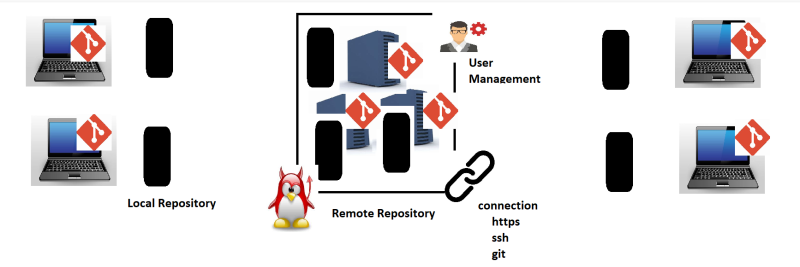

# version conrol system

* This is a sofware which helps organizaion to maintain the sourse code.
* any version conrol system we have to maintaining hisory of changes.
* vcs allows us to maitain track off different releases which we give to 
  customers.
* vcs allows parllel development multiple developers.
 ### Repository:
 repository any storage location which can maitaining history
  ## types of version conrol sysem

### local version control sysytem :
1. it is a single machine multi user version conrol sytem
2. it is not scalable
   
 ### centralized version control sysem: 
 1. client(which is a developer)
 2. server
 3. this is multi machine concept 
   where your code history is maintained
   
 ### distribued version control sytem:
 1. we have one local repository which connect multiple remote repositories
  

  # GIT
  * Git is a Distributed Version Control System
  * While using we have two options for Remote Repositories
       * Self-Hosted: Host it on your own.
             Options: 1. gitolite
                      1. git lab self hosted
       *  Cloud-Hosted: Hosted by some service provider.
            Options: 1. Github
                     1. Bitbucket
                     2. git lab
                     3. azure source repos
                     4. Aws code commit