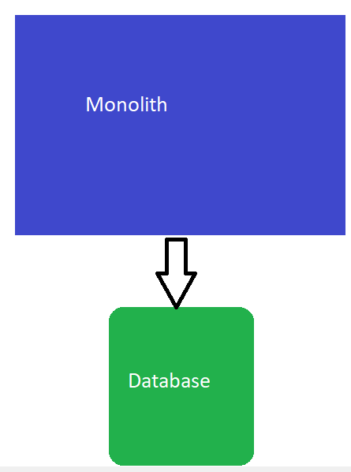
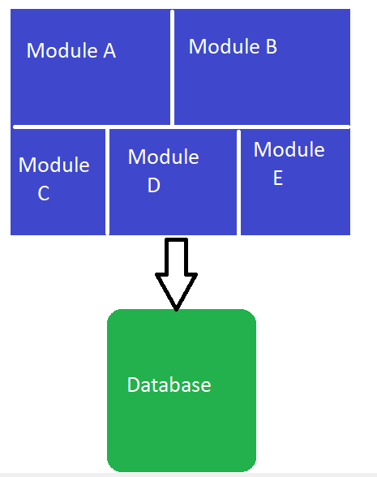
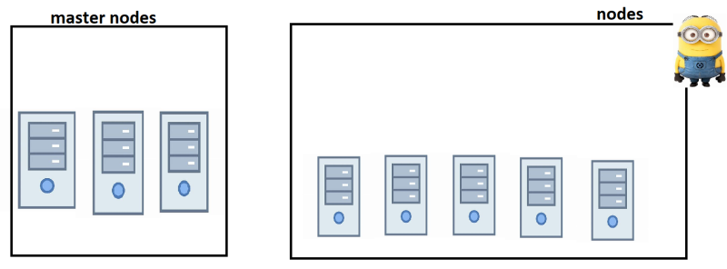
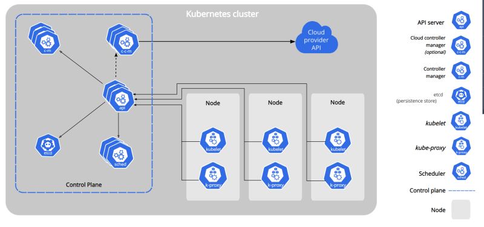
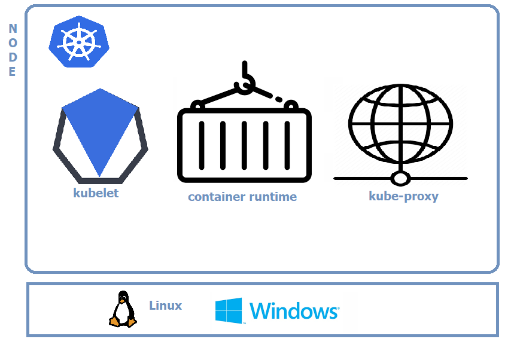
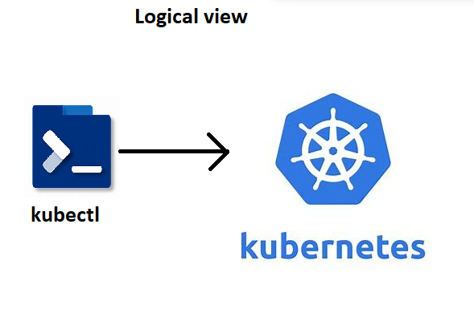
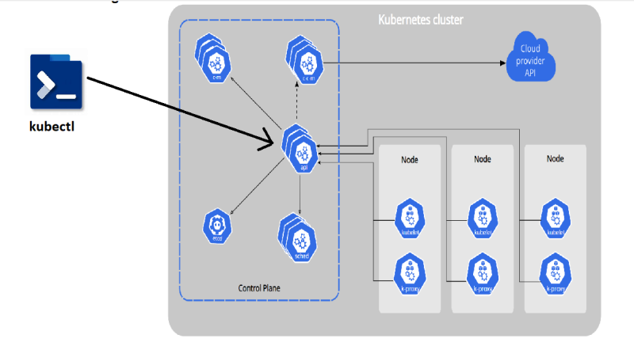
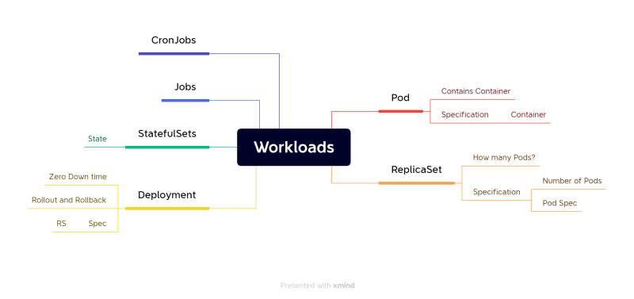

# k8s
## Need for k8s
### High Availability
* when your application is running in Docker Containers for some reasons in your Applications is gone Down that means your Container is Exited State or Stoped State.So Your application will have a Downtime. Now check my application is gone into the Exited or stoped state Now i would go probably Docker Container Run or Start Command are execute and Make the Conatainer Work

* The problem is When your working in Single System . If there is Some Software Which Recogniges that When Containers goes Down it will automatically Do the Work So Starting Containers back  So your application is always Up and Running. There is Some Application can Do that . It will help us 

`When we Run our Application in Docker Containers and if Containers fails we need to Manually Start the Conatiner(Container Down)`
      
 `If the Node i.e The machine Fails all the Container Running on the same machine it Should be Re-Created on Other machine(Node Down)`
####  k8s Can do both the above But Docker which cannot do it. might Docker Swarm Does it

## Auto Scalling:-
   We are Running E-commerse application in Docker Container and There is Discount Season and Discount Sale what happend is lot of traffic is there. when there is lot of traffic your application cannot Run exactly same number.earlier you would try to run 10 conatiners you might need 20 or 30

#### Containers Don't Scale on their Own
   Scalliing is of two types
   * ` Vertical Scalling` 
   * ` Horizontal Scalling`
   * Vertical Scalling :
      `Increasing Size of the Conatiner`
   1. ntially you would give 256 Mb but now you will give 512 Mb
   2. intially you are giving 1 CPU and now you are giving 2 CPUs
   * Horizontal Scalling:
      `Increasing number of Containers`
1. You application is runnning in One Container Now you are going to Run 10 Containers

    K8s can do both Vertical Scalling  and Horizontal Scalling of Conatiners

### Zero-Downtime Deployment
 Generally when we run on Application in Containers it is not guarenteed that it could be the same containers running forever it will always get new realeses and then we moving from older Version into Newer Version we would want to Zero-Downtime or Near Zero-Downtime Deployments
  * ` k8s can handle Deployments with near Zero-Downtime Deployments`
  * ` k8s can handle rollout(newverion) and rollback(Undo new version => Older Version)`
  #### k8s is Described as `Production grade container Management`
  
### History
 
 Google had a History of running everything  on Containers
 To manage these Containers,Google has developed Container Management tools(inhouse or internelly)
 * `Borg`
 * `omega`
* With Docker publicizing containers, With the experience in running and managing containers, Google has started a project Kubernetes (developed in Go) and then handed it over to `Cloud Native Container Foundation (CNCF)`
  
### Competetiors:
* Apache Mesos
* Hashicorp Nomad
* Docker Swarm
* But K8s is clear winner

## Monolith:
* This is a unit of deployment, where all the functionality of the system has to be deployed together
* Single Process Monolith
  
  
* Modular Monolith: Subset of Single Process Monolith
  

* Challanges:-

* The whole application has to be deployed and the necessary changes in the database also should be up to the mark
* When there is load on som part/module of your application and you need to scale the whole application

## What are micro services
* Microservices are independently deployable services modelled around business domain.
* These microservices communicate with each other via networks

* Each service can be developed in a differnt programming language as the communications between microservices are generally over http
* Challenges:
     * Microservices are distributed systems, so managing the application is more complex than a monolith
     * For deploying the applications which are microservices and handling challenges, we would require an orchestration software and kubernetes is best player in this area.
 * 
  
  ### K8s is not designed only for Docker
 * Initially k8s used docker as a main container platform and docker used to get special treatment, from k8s 1.24 special treatment is stopped.
* k8s is designed to run any container technology, for this k8s expects container technology to follow k8s interfaces.
  ` One of major properties of k8s is Self healing`
  ` K8s is distributed application which is called as k8s cluster`
  
### K8s take care of
* Scaling requirements
* Failover
* Deployment Options
* K8S provides
* Service Discovery & Load Balancing
* Storage Orchestration
* Automated rollouts and rollbacks
* Self-Healing
* Secret and Configuration Management
* K8s is a platform that manages container based applications, their network 
  and storage components
* K8s Can be installed in many ways
    * Self Hosted => where we install k8s
           minikube
           Kubeadm
           Kube Spray
* Cloud Hosted Services => Kubernetes as a Service
AWS => Elastic Kubernetes Service (EKS)
Azure => Azure Kubernetes Service (AKS)
Google => Google Kubernetes Engine (GKE)

# K8s Architecture
 * Official Architecture image
  

* Other easier representations
### Master Node

### Node

* Clients
    * kubectl
    * any rest based client
  ### Logical view
  
### Actual view
  

#### K8s Components

* Node: what is required to Run your Container
*  Client is nothing but What is necessary for you to tell the work to the Cluster
*  Pod: the smallest unit of  creation inside k8s is pod
   ### Control plane components (Master Node Components)

* kube-api server
* etcd (*)
* kube-scheduler
* controller manager
* cloud controller manager
  
  #### kube-api server
* `Handles all the communication of k8s cluster`(control plane and nodes)
* Let it be internal or external
* The API server is  exposes fuctionality over Http(s) protocol and `k8s API`
  
#### ectd
1.`This is memory of k8s cluster`
           or
k8s uses etc to store all the cluster data
2. This is distribute key-value store
#### scheduler
`Scheduler is responsible for creating k8s objects(pods) and scheduling them on right node`
#### Controller Manager
1. `This ensures desired state is maintained`
2. This `reconcilation loop` that checks for desired state and if it mis matches doing the necessary steps is done by controller
#### Cloud Controller
`This is component in k8s with cloud specific knowledge`
### Nodes have the following component

 
#### kubelet
* `This is an agent of the control plane`
* Kubelet recieves requests/orders to create new Pods
#### Container Runtime
* `This is technology in which your container is created `
                      or
* Container technology to be used in k8s cluster
* in our case it is docker.
#### Kube-Proxy
* `This maintains network rules on the nodes`
* This is a network proxy that runs on each node in k8s
#### kubectl
* `kubectl communicate with the Cluster to create resourses`
* K8s is designed to work with any container technology.
* ` K8s is cluster so we interact with master nodes`. There are two ways of interacting, where as for k8s it exposes APIs.
     * From code/restapi with json
     * From command line where k8s gives a cmd line tools kubectl
* In kubectl can be interacted in two ways
           `imperative (commands)`
           `declarative (yaml)`
* To `k8s we always express the desired state` (What is that we want)
*  `These yaml files where we describe our desired state are called as 
   manifests`
  ### Node contoller 
  `it will checks for node failures`
  ### Replication controller
  `it will checks for Container Count`
  ### What is k8s manifest
This is a yaml file which describes the desired state of what you want in/using k8s cluster

### K8s Objects
* `Everything in k8s is an Object`
* `Every Object has Spec and Status`
* Spec: Specification(What we have asked)
* Status: What was Created
### Pod

* The smallest unit of creation is Pod
* Pod has a Container(s)
* Every Pod gets an API adress 
### pod lifecycle

* Pending
* Running
* Succeded
* Failed
* Unknown
### Container States in k8s pod
* Waiting
* Running
* Terminated
### K8s Workload

### API Versioning
APIs are grouped as apigroups:
* core
* batch
* networking.k8s.io
#### Controllers in K8s
  
* Controllers in k8s control/maintain state of k8s objects
* Controllers are k8s objects which run other k8s resources. This k8s resource will be part of specification generally in template section.
* Controllers maintain desired state.
* Some of the controllers are
      * Replication Controller/Replica Set
      * Stateful Sets
      * Deployments
      * Jobs
      * Cron Jobs
      * Daemonset      
### K8s Jobs
K8s has two types of jobs
* Job: Run an activity/script to completion
* CronJob: Run an activity/script to completion at specific time period or intervals.

* Backofflimit: if job fails the pod it will be Restarted
* ActiveDeadlineSecond: if Script is not finishing it will Stop
* Running job waiting for Completion
* When you delete the Controller Chaild Objects also deleted
* Controller Controll the Job and Job Controll the Pod
* `ImagepullBackoff`:The status ImagePullBackOff means that a Pod couldn’t start, because Kubernetes couldn’t pull a container image. The ‘BackOff’ part means that Kubernetes will keep trying to pull the image, with an increasing delay (‘back-off’).